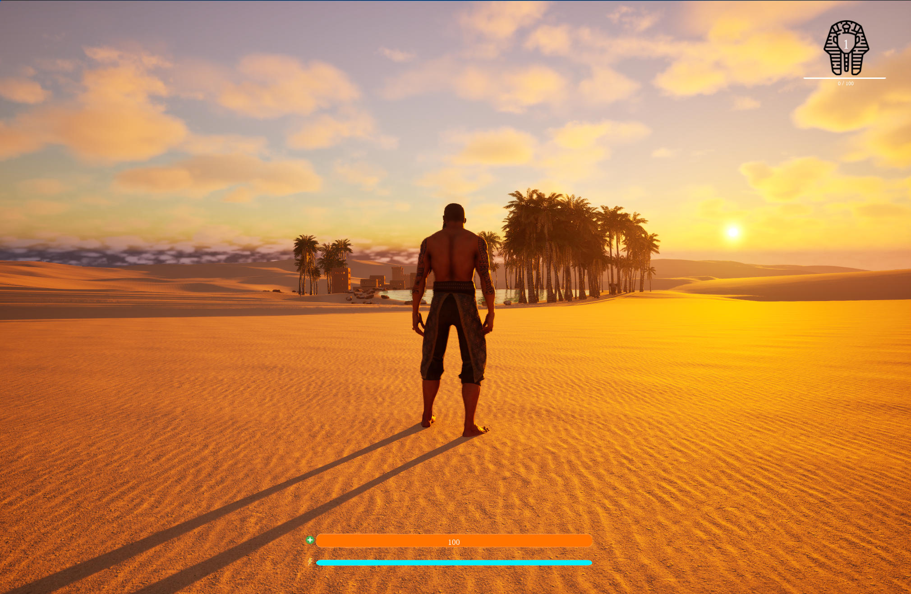
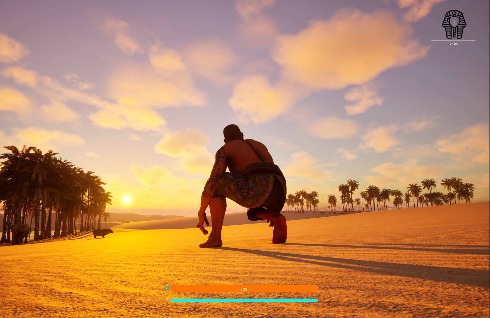
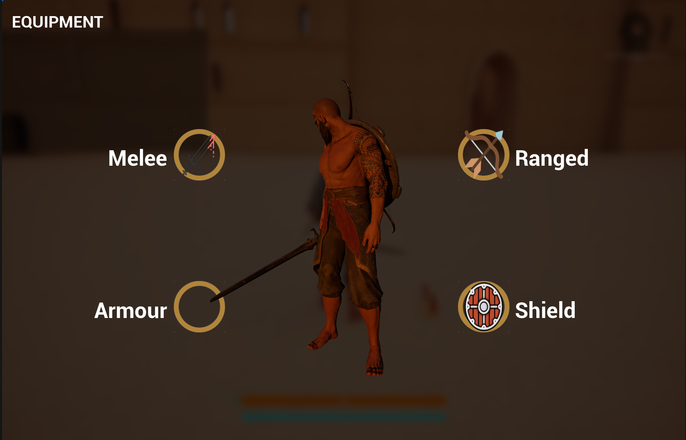
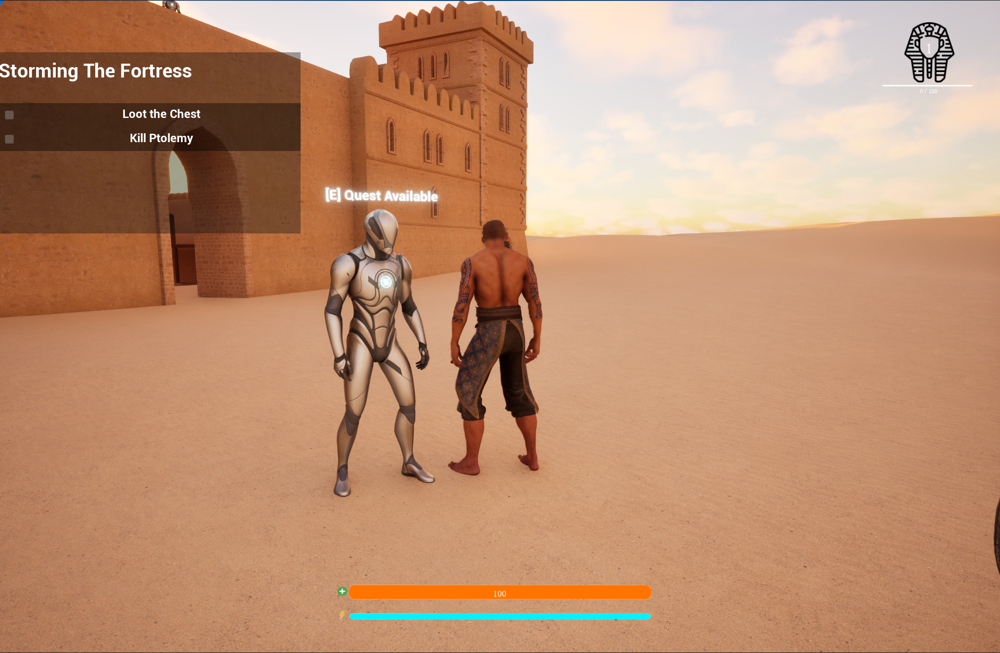
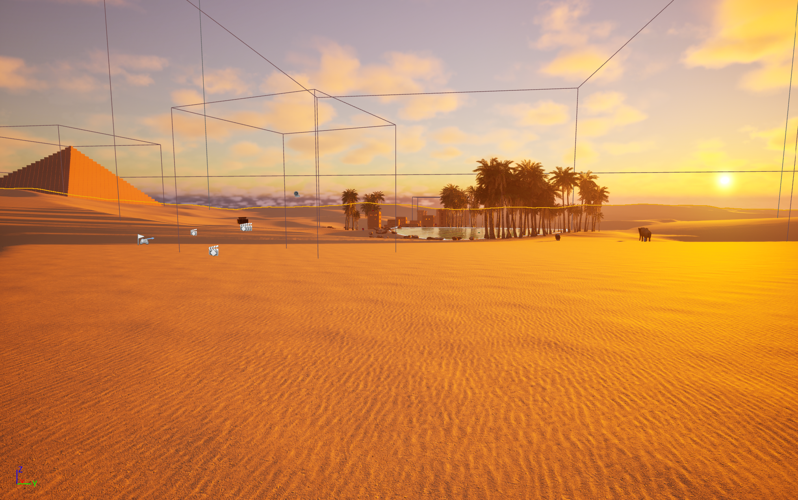

# UnrealEngine5-RPG-Demo
This is an interactive RPG prototype developed in Unreal Engine 5 using Blueprint-based systems. It demonstrates complex, interconnected gameplay and system softwares including AI behaviour, event-driven UI, state management, and player progression mechanics. The project was built through independent implementation, customisation, and debugging, using a structured Unreal Engine 5 tutorial as a foundation. 
## Demo Video
[Watch Gameplay Demo](https://drive.google.com/file/d/1NAffCJ96p9DaqcCkBhthIEP2b5sKqhqN/view?usp=sharing)
## Key Features Shown in the Video (In Order)

**Opening and World Systems**
- Intro cinematic shown on the first game launch
- Large open-world environment built using Landscape and Foliage tools
- Day/Night cycle
- Footstep system tied to player movement

**Core Player Mechanics**
- Third-person movement, including sprinting, crouching, jumping, and dodging
- Health and Stamina system
- Parkour and assassination systems
- Player respawning
- Save game system

**AI & Combat**
- AI-driven animal enemies with perception, sounds and attack behaviour
- Combat system integration

**UI & Game Flow**
- Fully functional pause menu and main menu
- Inventory and equipment system

**Progression and Quests**
- Quest system with objective tracking and completion
- Player levelling system

## Tools and Technologies
- Unreal Engine 5.5
- Blueprint Visual Scripting
- Animation Blueprints and State Machines
- UI (UMG)
- AI Behaviour Trees and Controllers
- Fab Asset Marketplace

## Development Notes
- This repository is for documentation and presentation purposes
- Full Unreal Engine 5 project files are not included due to size and asset licensing constraints
- This project was developed using a structured Unreal Engine 5 tutorial as a foundation. All gameplay mechanics were implemented manually and extended through customisation, debugging, and adaptation across the engine versions and assets

## Screenshots

**Opening Cinematic**

**Player Movement**

**Combat & AI**

**Inventory / UI**

**Quest System**

**World / Environment**

## What I Learned
This project helped me develop a deeper understanding of systems-based design and Unreal Engine 5 workflows through hands-on implementation and iteration:
- Designed and connected multiple interactive systems using Blueprint-based architecture
- Implemented AI behaviour and state logic with animation-driven feedback
- Built and managed interactive UI systems, including menus and inventory tracking
- Structured and persisted system states such as player progression and quests
- Debugged complex Blueprint logic and adapted systems across engine versions
- Managed large open-world environments with Landscape and Foliage tools
- Balanced scope and polish when developing a long-form, systems-heavy prototype
- Applied event-driven programming and systems-thinking skills transferable to software engineering roles
